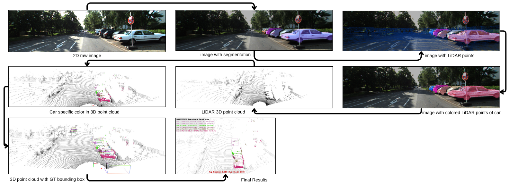

# car detection algorithem using lidar point cloud data
This project implements **LiDAR–image fusion and 3D object detection** using YOLOv8x segmentation and the KITTI-360 dataset.  
The goal is to project LiDAR points onto 2D images, segment cars using semantic segmentation, visualize them in 3D, and evaluate detection performance using precision and recall metrics.

# Repo structure: 
  - code : it contains two python files
  - output : this folder contains all output images
  - Kitti-360 source zip file : this file contains all the necessary files to run the code. 
  - project report : the detailed description of the project 

# Flowchart of the Project:

